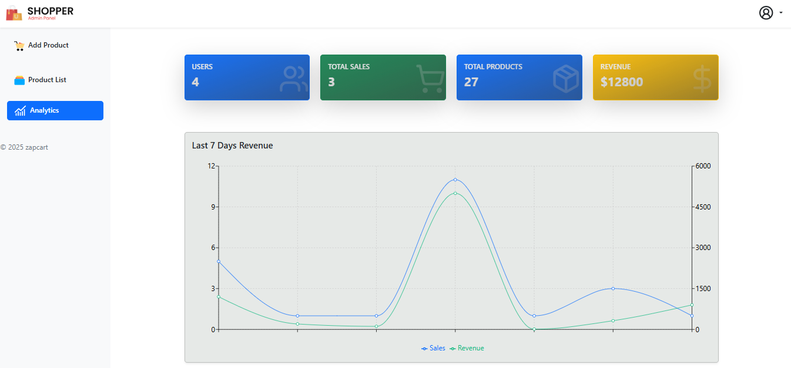
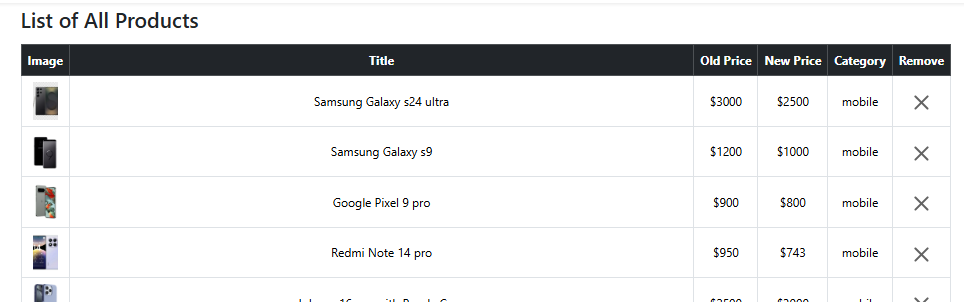
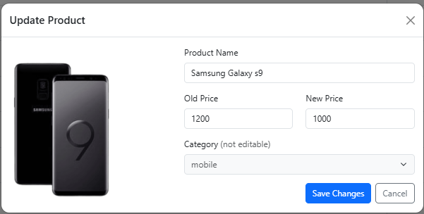
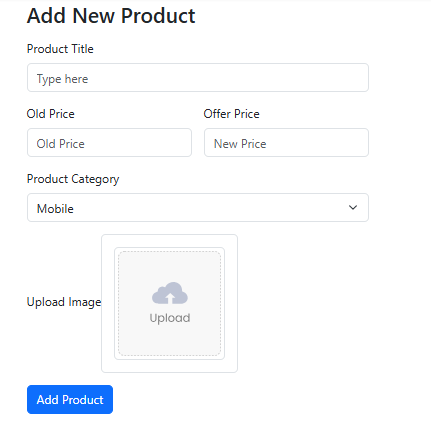

# 🛒 ZapCart — MERN Stack E-Commerce Platform for modern Smartphones, Tablets and Accessories


<p>
  
  
  
  
  
</p>


ZapCart is a full-stack e-commerce application built with the **MERN stack (MongoDB, Express.js, React, Node.js)**. It features both a customer-facing frontend and an admin panel, offering full control over product management, analytics, and order tracking.

---

## 🚀 Features

### 🧍 User Features

- ✅ User Signup, Login, Logout (JWT-based Auth)
- 🛒 Add & Remove Products from Cart
- 🧠 Cart Persistence (Logged-in users keep cart saved)
- 📱 Browse Products by Category:
  - Smartphones
  - Tablets
  - Accessories

### 🛠 Admin Panel

- 📦 Create New Products
- 🗂 View, Update, and Delete Products
- 📊 Analytics Dashboard:
  - Total Products
  - Registered Users
  - Orders Count
  - Revenue Statistics

---

## 🛡️ Security & Enhancements

- ✅ **JWT Authentication** for secure login
- ✅ **CORS** and **cookie-parser** for session management
- ✅ **Arcjet** for rate limiting and bot protection
- ✅ **Cloudinary** for image uploads
- ✅ **MongoDB Atlas** as the primary database

---

## 📁 Folder Structure

```
zapcart/
├── admin-panel/
│   └── src/
│       ├── components/
│       └── pages/
│
├── backend/
│   ├── config/
│   ├── database/
│   ├── middleware/
│   ├── controllers/
│   ├── routes/
│   └── server.js
│
├── frontend/
│   └── src/
│       ├── components/
│       └── pages/
```

---

## 📦 Tech Stack

| Area       | Tech                         |
|------------|------------------------------|
| Frontend   | vite + React, Bootstrap      |
| Backend    | Node.js, Express.js          |
| Database   | MongoDB Atlas                |
| Cloud      | Cloudinary (Images)          |
| Security   | JWT, Arcjet, cookie-parser   |

---

## ⚙️ Installation Guide

### Prerequisites

- Node.js
- MongoDB Atlas account
- Cloudinary account
- Arcjet Account (optional)

### 1. Clone the Repository

```bash
git clone https://github.com/Basit107/zapcart.git
cd zapcart
```

### 2. Backend Setup

```bash
cd backend
npm install
```

- Create a `.env` or `.env.development.local` file in `backend/` with:

```env
PORT=5000
MONGO_URI=your_mongo_uri
JWT_SECRET=your_jwt_secret

CLOUDINARY_CLOUD_NAME=your_cloud_name
CLOUDINARY_API_KEY=your_api_key
CLOUDINARY_API_SECRET=your_api_secret

ARCJET_KEY=your_arcjet_key
ARCJET_ENV=environment
```

### 3. Backend, Frontend & Admin Panel Setup

```bash
cd ../zapcart
npm install
```

### 4. Run Both The Frontend & Backend with these:


- <h3>For Frontend</h3>

```bash
cd /zapcart
npm run dev:frontend
```
- <h3>For Backend</h3>

```bash
cd /zapcart
npm run dev:backend
```

- <h3>For Admin Panel</h3>

```bash
cd /zapcart
npm run dev:admin
```
---

## 🔑 API Overview

| Method | Endpoint | Description |
|--------|----------|-------------|
| POST   | `/v1/users/signup` | Register a user |
| POST   | `/v1/users/signin` | Login user |
| POST   | `/v1/users/:id/addtocart` | Add item to cart |
| POST   | `/v1/users/:id/removefromcart` | Remove item from cart |
| POST   | `/v1/products/addproduct` | Create a product (admin) |
| PUT    | `/v1/products/:id` | Update a product (admin) |
| DELETE | `/v1/products/:id` | Delete a product (admin) |

---

## 📊 Admin Dashboard Preview








---

## 🌐 Live Demo

🚧 Not yet deployed

---

## 👤 Author

**Abdul Basit**

- GitHub: [Link](https://github.com/Basit107)

---

## 🙌 Contributions

Pull requests are welcome. For major changes, please open an issue first to discuss what you would like to change.

---

## 📌 Future Improvements

- ✅ Search button to search products
- ✅ Order history & invoice downloads
- ✅ Full mobile responsiveness
- ✅ Full bootstrap 5 css
